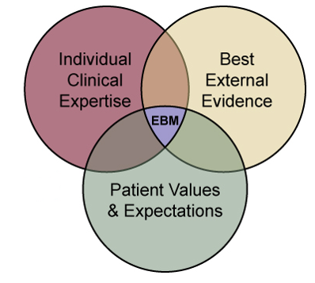

# ¿Qué es la medicina basada en evidencias? {#intro}

Originalmente la medicina basada en evidencias (MBE) se definió como el uso conciente, explícito y juicioso de la mejor evidencia disponible para la toma de decisiones sobre la atención individual de pacientes [@sackett1996evidence].
La versión actualizada de éste concepto se definió como:

  > "La integración de la mejor evidencia en **investigación** con el **expertiese clínico** y los **valores del paciente**." [@straus2018evidence]

Ésta última definición prioriza una aproximación sistemática a la resolución de problemas clínicos que incluyen al paciente de forma activa, la experiencia del/la clínico y los resultados en investigación. A éste conjunto de características se le ha llamado la **tríada de la medicina basada en evidencias.**

## ¿Qué competencias de MBE necesitan TODOS los médicos clínicos?

**Habilidades elementales en MBE.**

A continuación se presenta una lista no exahustiva de las habilidades que tod@ médico clínico debe tener, indistinto de su nivel de especialización o lugar de trabajo [@slawson2005teaching].

  - *Information mastery*: la capacidad de encontrar la mejor evidencia para la práctica del día a día.
  - Tener información *en tiempo y forma* en el pointo de atención para la toma de decisiones clínicas.
    - Basadas en la internet u *offline*.
  - Evaluar información generada por expertos, **incluyendo colegas**, educación médica continua, presentaciones, revisiones y guías.
  - Evaluar de forma crítica información de representantes de farmaceúticas y/u otros promotores de terapeúticas alópatas o alternativas.

## Habilidades que solo un pequeño porcentaje de médicos clínicos necesitan dominar.

**Habilidades avanzadas en MBE [@slawson2005teaching].**

  - Evaluación crítica e interpretación de investigaciones en:
    - Terapias.
    - Procesos diagnósticos.
    - Test diagnósticos.
    - Estudios de pronóstico.
  - Evaluación crítica e interpretación de:
    - Revisiones sistemáticas (incluyendo meta-análisis),
    - Análisis de decisión,
    - Guías de práctica,
    - Marketing farmaceútico.
  - Asignar niveles de evidencia a hallazgos en investigación.
  - Enseñanza de competencias elementales en MBE.
  - Producir comunicaciones orales y por escrito de hallazgos en investigación.
    - Para pacientes.
    - Para colegas médicos.

### ¿Quiénes deben aprender competencias avanzadas?

  - Médicos que son vistos como líderes de opinión en su campo.
  - Clínicos que entrenan a otros médicos.
  - Médicos en centros de referencia para su especialidad/línea de práctica clínica.
  - Médicos educadores, escritores quienes proveen información para otros consumidores de información clínica.
  - *¿Médicos de la [Clínica del Estilo de Vida](http://clinicadelestilodevida.org/)?*

## MBE en la práctica.

Inicialmente el proceso de la práctica clínica basada en evidencia se realizaba leyendo publicaciones del área de expertiese clínica de interés, el médico dispondría una cantidad de tiempo semanal/diario a leer publicaciones relevantes.

Si ésto fuera la práctica actual sería imposible para el clínico leer todas las publicaciones relevantes de su área de interés y mantener una práctica diaria efectiva.

Otro detalle que surgue al intentar seguir la práctica mencionada es que, la mayoría de los documentos leídos no tendrían relación con los pacientes atendidos en la práctica del día. Ésto causa una desconección cognitiva, dificultando el aprendizaje a largo plazo de los descubrimientos publicados.

  > Si pudésemos alinear el aprendizaje y actualización del clínico a las necesidades de sus pacientes en la práctica diaria tendríamos, entonces, una estrategia con mayor probabilidad de éxito para el aprendizaje del médico y el beneficio directo de sus pacientes [@bordley1997evidence].

Es aquí donde la práctica contemporánea de la Medicina Basada en Evidencias toma relevancia y brilla por su efectividad para empoderar a los clínicos en función de las necesidades de sus pacientes.

## Propuesta de proceso de la MBE

El siguiente proceso ha sido propuesto como una guía general para integrar la práctica de MBE a la práctica clínica [@bordley1997evidence].

  1. **El paciente:** Comienza con un problema o pregunta que surja del proceso de atención de tu paciente.
  1. **Integra una pregunta:** Construye una pregunta estructurada derivada del caso.
  1. **Fuentes de información:** Selecciona la fuente/s apropiada/s y realiza una búsqueda.
  1. **Evaluación de información:** Evalúa la evidencia en función de su validez (cercanía a la *verdad*) y aplicabilidad (¿qué tan usable es en tu práctica clínica?)
  1. **El paciente:** Regresa a tu paciente, integra la evidencia con tu expertiese clínico, las preferencias del paciente y toma una decisión de aplicación en la práctica.
  1. **Autoevaluación:** Evalua tu rendimiento con el paciente y el caso en particular.
