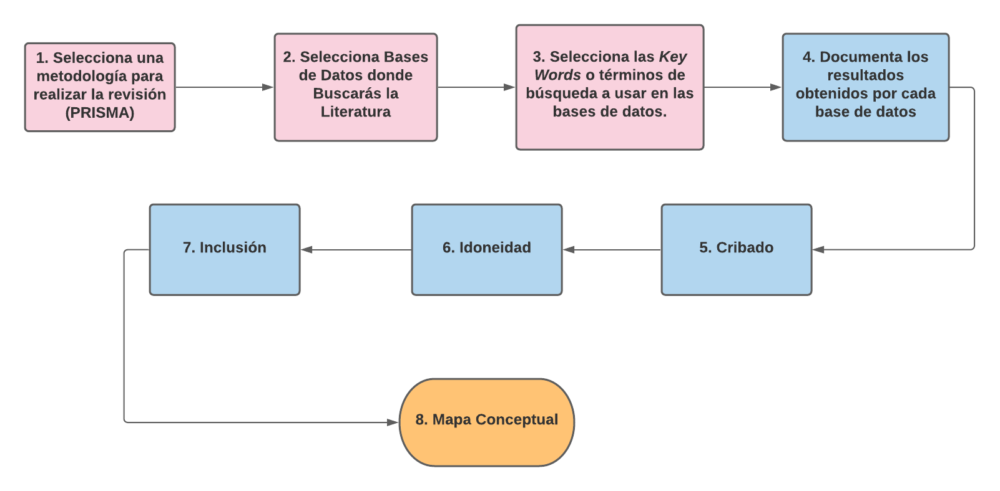
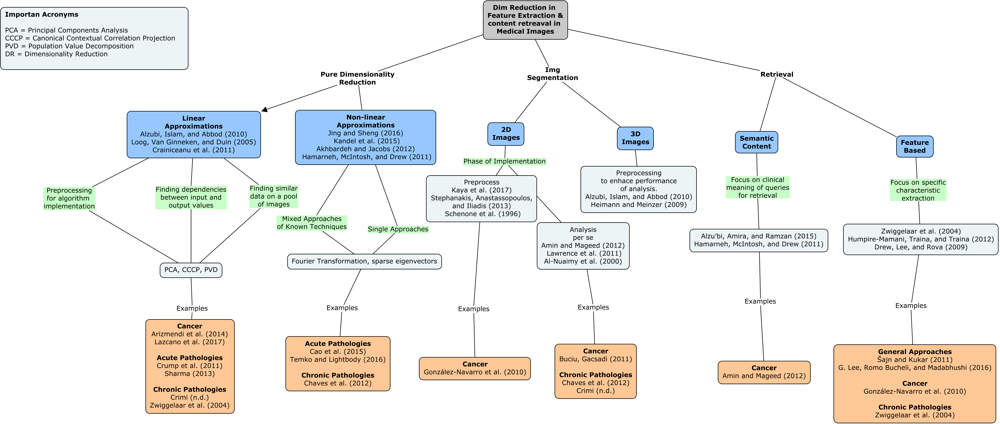

# Cómo Organziar una Búsqueda Bibliográfica

## Generalidades en video

## Descripción gráfica del proceso de búsqueda bibliográfica

## Ejemplo de una implementación

### Summary
The purpose of this exercise is to report the findings of a literature review on the topic of dimensionality reduction in feature extraction and content retrieval within the scope of medical images, the role they play in this area of knowledge and potential areas of opportunity for further research.
The results of the process is expressed in a mind map showing key concepts in the following specific areas:

**Dimensionality reduction *per se* ** where linear and non-linear approaches are highlighted with specific techniques pertinent to the domain are mensioned. **Image segmentation**, for this area the review of the literature allowed to identify a tendency in the analysis of 2D or 3D images, with varied algorithms for the implementation or reconstruction of models reported. The last section identified was the **retrieval of content in images**, where the identification of specific features is the traditionally approach, lately an interest in semantic content retrieval has been seen in the literature, where not only specific features or shapes are retrieved but the clinical meaning of those features starts playing a role in the process of content retrieval. This seems to be a promising area of development in order to bring these approaches to an day to day clinical practice.

Once the previous main sections were identified, a summary of the key concepts of the approach in each of them was laid out, mentioning the specific algorithms used and the phase of the analysis in which they are utilized.

The last layer in the concept map shows concrete examples applied to clinical settings of the concepts mentioned in the more theoretical layers. It was interesting to find publications of clinical approaches of all the areas mentioned in the concept map.

### Generalities and style of approach selected
In order to keep a systematic approach to the process of accomplishing this exercise I made use of the [*Preferred Reporting Items for Systematic Reviews and Meta-Analysis (PRISMA)*](http://www.prisma-statement.org) methodology and adapted it for the specific needs of the excercise.

The citation manager used was Mendeley.

### Databases and results

The following data bases were consulted with results obtained by the indicated queries:

- **Google Scholar**
    - "medical images" + "x rays" + "Dimensionality reduction" + “spine”
    - 80 results.
- **Web of Science**
    - “Dimensionality reduction AND medical images”
    - 78 results.
- **WoltersKluver – OvidMD**
    - “Dimensionality reduction AND medical images”
    - 102 results.
    
Different queries were used in the last two databases because the implementation of the same queries used in Google Scholar gave no results so the set was progresively deintegrated until a viable result was obtained.

### PRISMA flow chart

The following image sums up the componentes of the PRSIMA process used int this excercise:

### Results in a Concept Map

