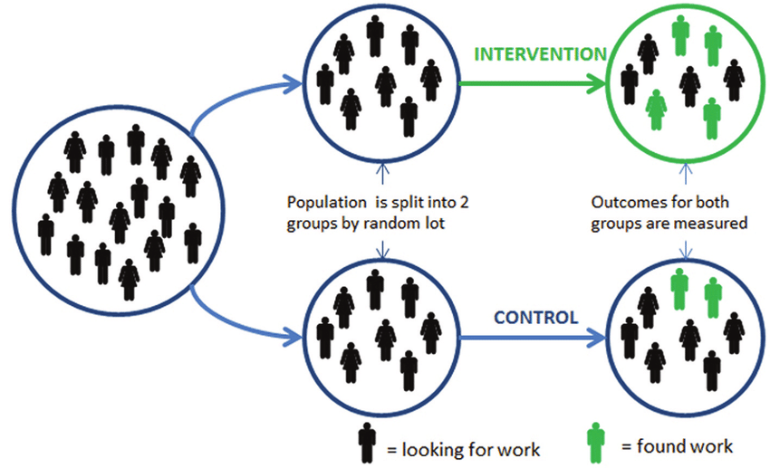
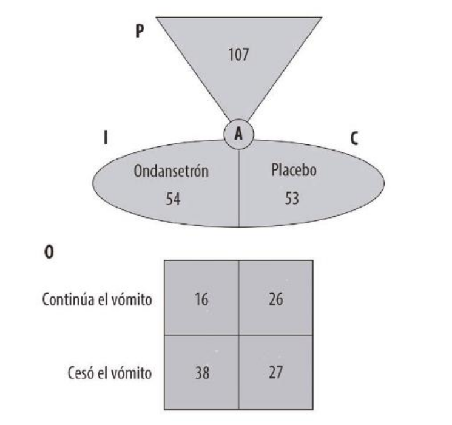

# Evaluando Estudios de Intervenciones

## Generalidades
Los estudios de intervención pueden ser enfocados en tratamientos o en estrategias de prevención medibles. Se utilizan ampliamente en la práctica clinica para tomar decisiones sobre terapia en pacientes del día a día.

La mejor metodología disponible para determinar la eficacia de una intervención, ya sea terapeútica o de prevención es el **ensayo clínico aleatorizado**.

<center>

</center>

Una aproximación a la evaluación de éstas publicaciones desde un cuestionario estructurado es recomendable porque permite sistematizar la evaluación y facilita la adopción por parte del clínico @barratt1999users, @cuello2015medicina.

## Cuestionario Estructurado para Evaluación de *RCT*

### ¿Son los resultados válidos?

#### ¿Fué la asignación de los pacientes a los grupos de tratamiento y placebo aleatorizada?

#### Los pacientes que entraron al estudio, ¿Recibieron todos seguimiento hasta el final?

- ¿Se completó el seguimiento?
- ¿Fueron los pacientes analizados en el contexto de los grupos en los que fueron aleatorizados?
- ¿Se realizó el análisis por [intención de tratar (AIT)](https://www.google.com/url?sa=t&rct=j&q=&esrc=s&source=web&cd=4&ved=2ahUKEwjTvbCB1vXlAhXcHzQIHSPQCUQQFjADegQIAxAF&url=https%3A%2F%2Fwww.elsevier.es%2Findex.php%3Fp%3Drevista%26pRevista%3Dpdf-simple%26pii%3DS1138359300736197&usg=AOvVaw1gi41e5eO8pdPaLdRRQji6)?

#### ¿Fueron los pacientes y clínicos "cegados" al tratamiento?

#### ¿Eran los grupos similares al inicio del estudio?

- ¿Los factores pronóstico están balanceados entre los grupos?
  - Demografía.
  - Comorbilidades.
  - Severidad de la enfermedad.
  - Algúnos otros cofactores.
- Si hubo diferencias al inicio. ¿Se ajustaron?

#### Fuera de la intervención experimental. ¿Fueron los grupos tratados igualmente?

- ¿Hubo cointervención?
- ¿Se contaminaron los datos?
- Apego al tratamiento.

### ¿Cuáles son los resultados?

#### ¿Qué tan grande es el efecto del tratamiento?

- Reducción del riesgo absoluto.
  - La diferencia en el riesgo absoluto (taza de eventos adversos) entre las poblaciones de intervención y control (terapia).

- Reducción del riesgo relativo.
  - La medida en la que un tratamiento reduce el riesgo, comparado con pacientes que no recibieron el tratamiento de interés (terapia).

#### ¿Tuvo el estudio un tamaño de muestra suficiente?

#### ¿Qué tan preciso es el estimado del efecto del tratamiento?

### ¿Los resultados me ayudarán a mi práctica clínica?

#### ¿Pueden los resultados ser aplicados a mis pacientes?

- Los pacientes son similares a los míos en demografía, severidad de enfermedad, comorbilidades y otros factores pronóstico?
- ¿Existe alguna/s razón/es para no aplicar los resultados?

#### ¿Fueron todos los resultados clínicos relevantes considerados?
- ¿Se consideraron resultados clínicos surrogados?

#### ¿Valen la pena los beneficios sobre los daños y costos?
- Concepto de Número Necesario para Tratar.

## Formulario

<style type="text/css">
.tg  {border-collapse:collapse;border-spacing:0;}
.tg td{font-family:Arial, sans-serif;font-size:14px;padding:10px 5px;border-style:solid;border-width:1px;overflow:hidden;word-break:normal;border-color:black;}
.tg th{font-family:Arial, sans-serif;font-size:14px;font-weight:normal;padding:10px 5px;border-style:solid;border-width:1px;overflow:hidden;word-break:normal;border-color:black;}
.tg .tg-lboi{border-color:inherit;text-align:left;vertical-align:middle}
.tg .tg-9wq8{border-color:inherit;text-align:center;vertical-align:middle}
.tg .tg-9j3s{font-weight:bold;border-color:inherit;text-align:right;vertical-align:middle}
.tg .tg-uzvj{font-weight:bold;border-color:inherit;text-align:center;vertical-align:middle}
</style>
<table class="tg">
  <tr>
    <th class="tg-lboi"></th>
    <th class="tg-uzvj">Sí</th>
    <th class="tg-uzvj">No</th>
  </tr>
  <tr>
    <td class="tg-9j3s">Expuestos</td>
    <td class="tg-9wq8">a</td>
    <td class="tg-9wq8">b</td>
  </tr>
  <tr>
    <td class="tg-9j3s">No Expuestos</td>
    <td class="tg-9wq8">c</td>
    <td class="tg-9wq8">d</td>
  </tr>
</table>


**Control Event Rate (CER)**
$$CER = \frac{c}{c+d}$$

**Experimental Event Rate (EER)**
$$EER = \frac{a}{a+b}$$

**Relative Risk (RR)**
$$RR = \frac{EER}{CER} = \frac{\frac{a}{a+b}}{\frac{c}{c+d}}$$

**Relative Risk Reduction (RRR)**
$$RRR = \frac{CER-EER}{CER}$$
Ésta medida es la más reportada en estudios dicotómicos de efecto del tratamiento.

**Absolute Risk Reduction (ARR)**
$$ARR = CER-EER$$
**Number Needed to Treat (NNT)**
$$NNT = 1/ARR$$
Una reducción de riesgo podría impresionar al lector inexperto pero, ¿cuántos pacientes tendrías que tratar antes de detectar un beneficio? Éste concepto es a lo que se le llama *Number Needed to Treat* y es de bastante uso en la práctica clínica.

## Ejercicio 1

Asumiendo un estudio con los siguientes resultados:

<style type="text/css">
.tg  {border-collapse:collapse;border-spacing:0;}
.tg td{font-family:Arial, sans-serif;font-size:14px;padding:10px 5px;border-style:solid;border-width:1px;overflow:hidden;word-break:normal;border-color:black;}
.tg th{font-family:Arial, sans-serif;font-size:14px;font-weight:normal;padding:10px 5px;border-style:solid;border-width:1px;overflow:hidden;word-break:normal;border-color:black;}
.tg .tg-lboi{border-color:inherit;text-align:left;vertical-align:middle}
.tg .tg-9wq8{border-color:inherit;text-align:center;vertical-align:middle}
.tg .tg-9j3s{font-weight:bold;border-color:inherit;text-align:right;vertical-align:middle}
.tg .tg-uzvj{font-weight:bold;border-color:inherit;text-align:center;vertical-align:middle}
</style>
<table class="tg">
  <tr>
    <th class="tg-lboi"></th>
    <th class="tg-uzvj">Sí</th>
    <th class="tg-uzvj">No</th>
  </tr>
  <tr>
    <td class="tg-9j3s">Expuestos</td>
    <td class="tg-9wq8">8<br></td>
    <td class="tg-9wq8">992</td>
  </tr>
  <tr>
    <td class="tg-9j3s">No Expuestos</td>
    <td class="tg-9wq8">10<br></td>
    <td class="tg-9wq8">990</td>
  </tr>
</table>

Calcula los siguientes indicadores:

- Riesgo relativo.
- Reducción del Riesgo Relativo.
- Número Necesario para Tratar.

**¿A qué conclusiones llegas una vez calculados los indicadores?**

## Ejercicio 2

Considera la siguiente publicación: [Ondansetron Decreases Vomiting Associated With Acute Gastroenteritis: A Randomized, Controlled Trial.](https://pediatrics.aappublications.org/content/pediatrics/109/4/e62.full-text.pdf)

Utilizando el formato [Graphic Appraisal Tool for
Epidemiological studies (GATE)](https://www.dropbox.com/s/60eeqxfa4kpwi45/jackson2006.pdf?dl=0), resumimos la metodología del estudio:

```{r echo=FALSE, fig.align='center', message=FALSE, warning=FALSE, out.width="60%", fig.cap="P = población o paciente, I = intervención, C = comparación, O = desenlace de interés."}
library(knitr)

```

Calcula los siguientes indicadores:

- EER.
- CER.
- RR.
- RRR.
- ARR.
- NNT.
