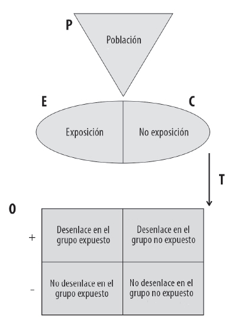
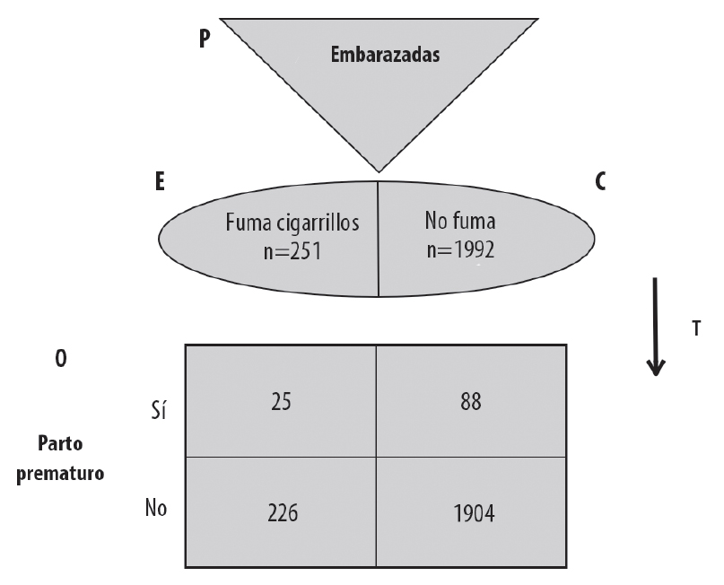
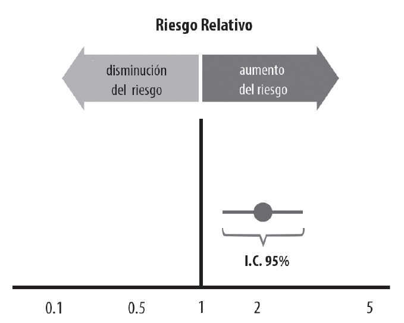
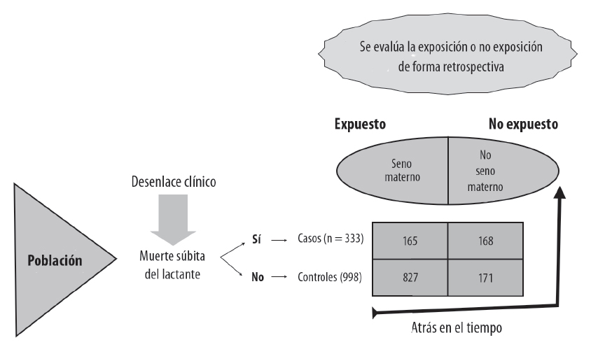
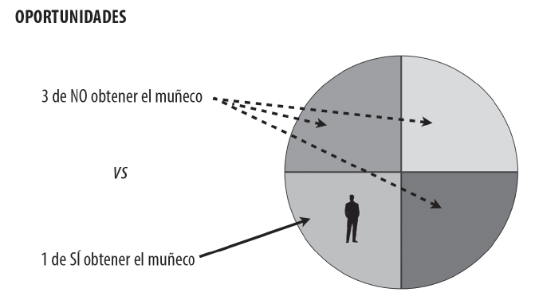

# Evaluando el Daño con Estudios Observacionales

En el mundo de la medicina, constantemente nos enfrentamos a preguntas como: ¿El tabaquismo está ligado al cáncer de pulmón? ¿El consumo de leche materna en lactantes disminuye el riesgo de muerte de cuna? ¿Llevar una alimentación basada en plantas puede impactar los indicadores metabólicos en pacientes diabéticos? ¿El uso del cinturón de seguridad salva vidas?

Las preguntas anteriores se pueden responder a través de estudios diseñados bajo una metodología observacional. Para los objetivos de ésta sección nos enfocaremos en dos tipos de estudio en específico:

 - **Estudio de casos y controles.**
 - **Estudio de cohorte.**

## ¿Cuándo Optar por Estudios Observacionales?
Habrá ocasiones (más frecuentemente de lo que quisiéramos) donde el estudio ideal para contestar una pregunta no es factible (imposible implementarlo), ésto podría deberse a varias razones como aspectos éticos, recurso económico, acceso a pacientes, infraestructura clínica, entre otras. Es en éstas situaciones donde los estudios de tipo observacional se vuelven relevantes y significativos.

Los estudios observacionales implican el estudio del riesgo.

## ¿Dónde se ubican los estudios de casos y controles y los de cohorte en el universo de investigaciones clínicas?

### **Horizonte de Metodologías en el Campo Médico**

### **Entendiendo el Universo un Poco Más**

### **Enfocándonos Únicamente en Estudios de Casos y Controles y Cohortes**

## Estudios de Cohorte

**SIEMPRE** debemos recordar los tres pasos esenciales al valorar lal iteratura médica:

 1. ¿Es la información válida? ¿Tiene riesgo de sesgo?
 1. ¿Es la información relevante (importante)? ¿Cuáles son los resultados?
 1. ¿Cómo puede ayudar a mi paciente con esta información?

El [método GATE](https://www.ufrgs.br/prodah/site/wp-content/uploads/2015/03/MartinA-SrihariV.pdf) también puede ser utilizado para entender y organizar rápidamente los resultados de un estudio de cohortes.

### Evaluando los resultados en estudios de Cohorte

Para practicar la evaluación de los resultados de un estudio de Cohortes utilizaremos el siguiente estudio:

 - [Spontaneous preterm birth and small for gestational age infants in women who stop smoking early in pregnancy: prospective cohort study](https://www.bmj.com/content/bmj/338/bmj.b1081.full.pdf)

Para iniciar la evaluación de éste estudio podemos comenzar por el cálculo del **riesgo relativo (RR)** también conocido como razón de riesgos y ***odds ratio (OR)***, también conocido como razón de momios. Éstos indicadores se vieron en el capítulo correspondiente a Estudios Clínicos Aleatorizados.

Por favor obten **RR** y **OR**, una vez que estén calculados interprétalos en el contexto clínico.

#### La "T Invertida" para interpretar el Riesgo Relativo

Con respecto al **RR**, es importante saber que, si el intervalo de confianza (IC) es de 95% (lo es para éste ejemplo) y éste aparece representado por completo hacia uno u otro lado de la unidad (1), que corresponde a la línea vertical en la "T invertida", se puede asumir que con un 95% de confianza hay un riesgo elevado (hacia la derecha de la T invertida, > 1) o disminuido (hacia la izquierda de la T invertida, < 1) del fenómeno en las poblaciones de estudio.

El ejemplo usado (que corresponde a la figura que se muestra de la T invertida) no abarca la unidad, por lo que podemos decir (con 95% de certeza) que el verdadero valor se halla entre esos dos puntos, o en otras palabras, el riesgo de parto prematuro se incrementa dos veces debido al tabaquismo, y puede ir desde 1.4 veces y hasta 3.4 veces más. 

## Estudio de Casos y Controles

El estudio de casos y controles es similar al estudio de cohorte en cuanto a que ambos son observacionales y no existe la distribución aleatoria de los grupos expuestos y no expuestos. La **diferencia** principal radica en el desenlace, el cual se evalúa en tiempo distinto. En Casos y Controles el desenlace se evalua de forma retrospectiva (hacia el pasado).

Utilizaremos el siguiente estudio para aproximarnos al análisis de resultados:

 - [Does Breastfeeding Reduce the Risk of Sudden Infant Death Syndrome?](https://www.dropbox.com/s/ah0e6xc5k5t9ib4/vennemann2009.pdf?dl=0)

La representación visual basada en el método GATE de éste estudio se presenta en la siguiente imágen:

### La Rosca de Reyes y *Odds ratios*

El equipo de medicina culinaria nos invita a todos a celebrar con una rica rosca de reyes vegana, ellos traen un proyecto para preparar roscas pequeñas que se dividen en **4** pedazos personales y nos invitan a probarlas. Claramente todos aceptamos y nos presentamos a tiempo y sin haber comido (con la esperanza de comer más de un pedazo). Al llegar nos damos cuenta que nos han organizado en grupos de 4 y nos han dado una rosca por cada grupo, también nos dicen que cada rosca trae un muñeco escondido y al que le toque el muñeco tendrá que planear los tamales (claramente veganos y bajos en grasa).

De volada todos comenzamos a hacer cálculos de probabilidad, porque pues se nos hace fácil...

 1. ¿Cuál es la probabilidad de que una persona del grupo (4 personas por grupo) obtenga un muñeco?
 1. Si quisiera comparar la probabilida de que me toque el mono en mi pedazo de rosca v.s. la probabilida de que no me toque... ¿Cómo lo podría obtener? De qué me serviría saber éste indicador?

La respuesta a la pregunta 1 muestra un riesgo en porcentaje, la respuesta a la pregunta 2 muestra los momios u *odds*.

#### Calcula los siguientes indicadores del estudio ejemplo de Cohortes:

 1. ¿Cuál es el riesgo de parto pretérmino en el grupo de mujeres expuestas al tabaco?
  1.  Expresa tu respuesta en razón de riesgos (RR)/Riesgo relativo y en *odds ratio* o razón de momios (OR).

**¿Cuándo usar Riesgos Relativos y Cuándo usar *Odds Ratio*?**
