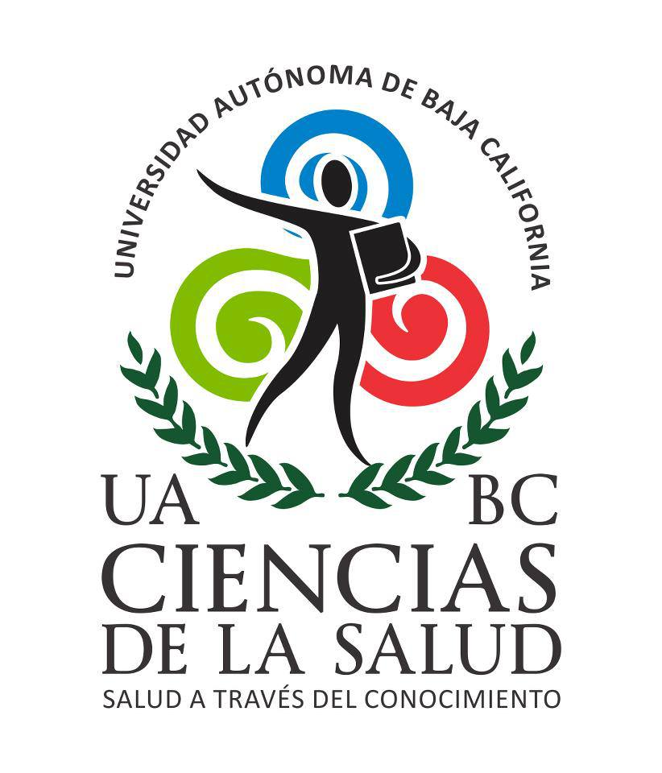

--- 
title: "Medicina Basada en Evidencias en Medicina de Estilo de Vida"
subtitle: "Una Aproximación Paso a Paso Para el equipo de Clínica del Estilo de Vida-Medicina Culinaria y Medicina Computacional."
author: "Gener J Avilés Rodríguez, Med, MSc, DrSc(c)"
date: "Marzo de 2021" #`r Sys.Date()`
site: bookdown::bookdown_site
output: bookdown::gitbook
documentclass: book
bibliography: [book.bib, packages.bib]
csl: vancouver.csl
link-citations: yes
github-repo: rstudio/bookdown-mbe
description: "Medicina Culinaria/ Medicina Computacional"
---

# Introducción

{width=30%}
{width=40%}

Éste manual digital está compilado para acompañar las sesiones colaborativas entre las actividades investigativas del grupo de la Clínica del Estilo de Vida - Medicina Culinaria y Medicina Computacional en la [Escuela de Ciencias de la Salud](https://medicina.ens.uabc.mx/component/content/featured), coordinado por las Doctoras [Fabiola Flores Monsivais](https://culinaryamedicinae.com), Lynette Amparo Velasco Aulcy y los Doctores [Jorge Castillo](https://www.facebook.com/culinarymedicinemx) y [Gener Avilés](https://www.linkedin.com/in/generaviles/).
